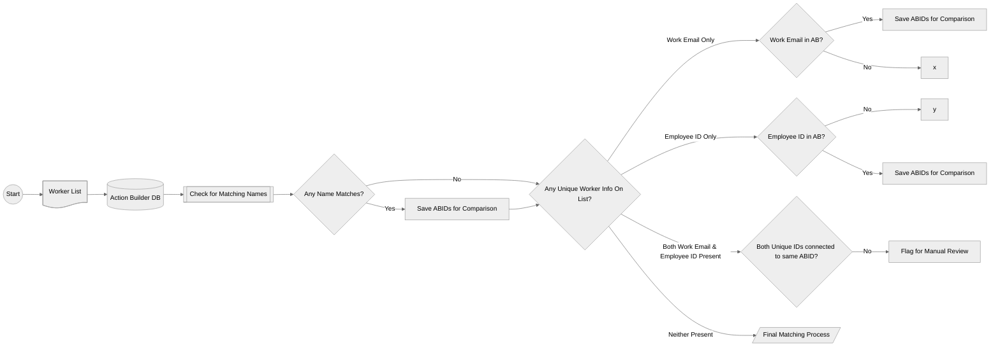

# Data Cleaning

```mermaid
---
config:
  layout: dagre
  theme: neutral
  look: classic
---
flowchart LR
    Start(("Start")) --> List@{ shape: doc, label: "Worker List" }
    List --> ActionBuilderDB@{ shape: cyl, label: "Action Builder DB"}
    ActionBuilderDB --> NameMatching@{ shape: fr-rect, label: "Check for Matching Names"}
    NameMatching --> CheckForNameMatches{"Any Name Matches?"}
    CheckForNameMatches -- Yes --> StoreABIDsFromNames["Save ABIDs for Comparison"]
    CheckForNameMatches -- No --> CheckUniqueIDs{"Any Unique Worker Info On List?"}

    StoreABIDsFromNames -->


    %% Work Email Section
    CheckUniqueIDs -- Work Email Only --> CheckWorkEmail{"Work Email in AB?"}
    CheckWorkEmail -- Yes --> StoreABIDsFromWorkEmail["Save ABIDs for Comparison"]
    CheckWorkEmail -- No --> x

    %% Employee ID Section
    CheckUniqueIDs -- Employee ID Only --> CheckEmployeeID{"Employee ID in AB?"}
    CheckEmployeeID -- No --> y
    CheckEmployeeID -- Yes --> StoreABIDsFromEmployeeID["Save ABIDs for Comparison"]

    CheckUniqueIDs -- Both Work Email & Employee ID Present --> CheckMatchForBothUniqueIDs{"Both Unique IDs connected to same ABID?"}
    CheckUniqueIDs -- Neither Present  --> FinalMatchingProcess[/"Final Matching Process"/]

    %% Work Email & Employee ID Logic
    %% CheckMatchForBothUniqueIDs -- Yes --> NameMatching
    CheckMatchForBothUniqueIDs -- No --> Flag["Flag for Manual Review"]


    %% Disambiguation Check Subgraph
    %% subgraph DisambiguationCheck ["Unique ID Disambiguation Check"]
    %%     CheckUniqueIDMatch["test"]
    %% end


    %% Work email match takes precedence
    %% CheckWorkEmail -- Yes --> CheckMatchForBothUniqueIDs
    %% CheckEmployeeID -- Yes --> CheckMatchForBothUniqueIDs

    %% If no work email, proceed to individual checks

    %% %% Name Matching Subgraph
    %% subgraph NameMatching ["Name Matching Process"]
    %%     CheckName{"Name Matches?"}
    %%     CheckName -- "Exact Name Match" --> ExitNameMatching["Proceed to Email Check"]
    %%     CheckName -- "Possible Nickname Match" --> ReviewNickname["Review Nickname Variations"]
    %%     CheckName -- "No Matches" --> ExitNameMatching
    %%     CheckName -- "Multiple Potential Matches" --> ExitNameMatching
    %%     ReviewNickname --> ExitNameMatching
    %%     ReviewNickname -- "No Acceptable Match" --> ExitNameMatching
    %% end

    %% %% Continue to Personal Email Check
    %% ExitNameMatching --> CheckPersonalEmail{"Personal Email Matches?"}

    %% %% Personal Email Check (now outside the subgraph)
    %% CheckPersonalEmail -- "Acceptable Match (Zero or One)" --> CheckPersonalPhone{"Personal Phone Matches?"}
    %% CheckPersonalEmail -- "Multiple Email Matches" --> FlagForReview["Flag for Further Review"]

    %% %% Personal Phone Check
    %% CheckPersonalPhone -- "Acceptable Match (Zero or One)" --> Matched
    %% CheckPersonalPhone -- "Multiple Phone Matches" --> FlagForReview

    %% %% Manual Review Subgraph
    %% subgraph FurtherReview ["Multiple Matches Review Process"]
    %%     FlagForReview --> GatherABIDs["Gather all relevant ABIDs"]
    %%     GatherABIDs --> ResolveConflicts{"Resolve conflicts?"}
    %%     ResolveConflicts -- "Conflicts Resolved" --> Matched
    %%     ResolveConflicts -- "No Consensus" --> ManualIntervention["Manual Intervention Required"]
    %% end
    %% Matched --> End(("End"))
```
