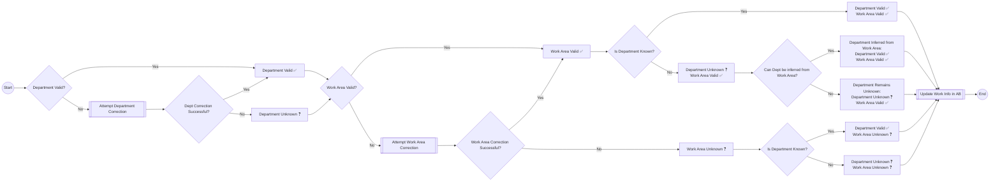

```mermaid
---
config:
  theme: mc
  look: classic
---
flowchart LR
    start(("Start")) --> deptCheck{"Department Valid?"}
    deptCheck -- Yes --> validDepartment["Department Valid ✅"]
    deptCheck -- No --> deptValidation[["Attempt Department Correction"]]
    deptValidation --> deptValidationResult{"Dept Correction Successful?"}
    deptValidationResult -- Yes --> validDepartment
    deptValidationResult -- No --> deptUnknown["Department Unknown ❓"]
    validDepartment --> workAreaCheck{"Work Area Valid?"}
    deptUnknown --> workAreaCheck
    workAreaCheck -- Yes --> validWorkArea["Work Area Valid ✅"]
    workAreaCheck -- No --> workAreaValidation[["Attempt Work Area Correction"]]
    workAreaValidation --> workAreaValidationResult{"Work Area Correction Successful?"}
    workAreaValidationResult -- Yes --> validWorkArea
    workAreaValidationResult -- No --> workAreaUnknown["Work Area Unknown ❓"]
    validWorkArea --> deptStatusCheck{"Is Department Known?"}
    deptStatusCheck -- Yes --> validWorkAreaAndDept["Department Valid ✅<br>Work Area Valid ✅"]
    deptStatusCheck -- No --> validWorkAreaAndUnknownDept["Department Unknown ❓<br>Work Area Valid ✅"]
    workAreaUnknown --> deptStatusCheck2{"Is Department Known?"}
    deptStatusCheck2 -- Yes --> unknownWorkAreaAndKnownDept["Department Valid ✅<br>Work Area Unknown ❓"]
    deptStatusCheck2 -- No --> unknownDeptAndWorkArea["Department Unknown ❓<br>Work Area Unknown ❓"]
    validWorkAreaAndUnknownDept --> inferDeptCheck{"Can Dept be inferred from Work Area?"}
    inferDeptCheck -- Yes --> deptInferred["Department Inferred from Work Area:<br>Department Valid ✅<br>Work Area Valid ✅"]
    inferDeptCheck -- No --> deptStillUnknown["Department Remains Unknown:<br>Department Unknown ❓<br>Work Area Valid ✅"]

    deptStillUnknown  --> checkForDataUpdate[["Update Work Info in AB"]]
    validWorkAreaAndDept --> checkForDataUpdate
    deptInferred --> checkForDataUpdate
    unknownWorkAreaAndKnownDept --> checkForDataUpdate
    unknownDeptAndWorkArea --> checkForDataUpdate
    checkForDataUpdate --> allResolved((End))
```
