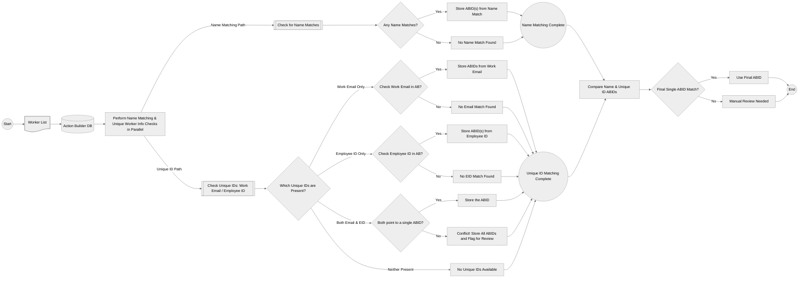

```mermaid
---
config:
  layout: dagre
  theme: neutral
  look: classic
---
flowchart LR

    %% ===================================
    %% START + INITIAL INPUTS
    %% ===================================
    Start(("Start")) --> WorkerList@{ shape: doc, label: "Worker List" }
    WorkerList --> ActionBuilderDB@{ shape: cyl, label: "Action Builder DB" }
    ActionBuilderDB --> ParallelChecks["Perform Name Matching & Unique Worker Info Checks in Parallel"]

    %% Parallel Check 1: Name Matching
    ParallelChecks -- Name Matching Path --> NameMatching[["Check for Name Matches"]]
    NameMatching --> HasNameMatch{"Any Name Matches?"}
    HasNameMatch -- "Yes" --> StoreABIDsName["Store ABID(s) from Name Match"]
    HasNameMatch -- "No" --> NoNameMatches["No Name Match Found"]
    StoreABIDsName --> NameMatchDone(("Name Matching Complete"))
    NoNameMatches --> NameMatchDone
    
    %% Parallel Check 2: Unique ID Matching
    ParallelChecks -- Unique ID Path --> UniqueIDMatching[["Check Unique IDs: Work Email / Employee ID"]]
    UniqueIDMatching --> WhichIDs{"Which Unique IDs are Present?"}
    
    %% Branch: Work Email Only
    WhichIDs -- "Work Email Only" --> CheckWorkEmail{"Check Work Email in AB?"}
    CheckWorkEmail -- "Yes" --> StoreABIDsEmail["Store ABIDs from Work Email"]
    CheckWorkEmail -- "No" --> NoEmailMatch["No Email Match Found"]
    StoreABIDsEmail --> IDMatchDone(("Unique ID Matching Complete"))
    NoEmailMatch --> IDMatchDone
    
    %% Branch: Employee ID Only
    WhichIDs -- "Employee ID Only" --> CheckEmployeeID{"Check Employee ID in AB?"}
    CheckEmployeeID -- "Yes" --> StoreABIDsEID["Store ABID(s) from Employee ID"]
    CheckEmployeeID -- "No" --> NoEIDMatch["No EID Match Found"]
    StoreABIDsEID --> IDMatchDone
    NoEIDMatch --> IDMatchDone
    
    %% Branch: Both Work Email + EID
    WhichIDs -- "Both Email & EID" --> CheckBoth{"Both point to a single ABID?"}
    CheckBoth -- "Yes" --> StoreABIDsBoth["Store the ABID"]
    CheckBoth -- "No" --> ConflictBoth["Conflict! Store All ABIDs and Flag for Review"]
    StoreABIDsBoth --> IDMatchDone
    ConflictBoth --> IDMatchDone

    %% Branch: Neither Unique ID
    WhichIDs -- "Neither Present" --> NoUniqueIDs["No Unique IDs Available"]
    NoUniqueIDs --> IDMatchDone

    %% After unique ID checks, final node for that path
    IDMatchDone(("Unique ID Matching Complete"))

    %% ===================================
    %% MERGE NAME & UNIQUE ID RESULTS
    %% ===================================
    NameMatchDone --> CompareResults["Compare Name & Unique ID ABIDs"]
    IDMatchDone --> CompareResults

    CompareResults --> FinalDecision{"Final Single ABID Match?"}
    FinalDecision -- "Yes" --> StoreFinal["Use Final ABID"]
    FinalDecision -- "No" --> Review["Manual Review Needed"]
    StoreFinal --> End(("End"))
    Review --> End

```
