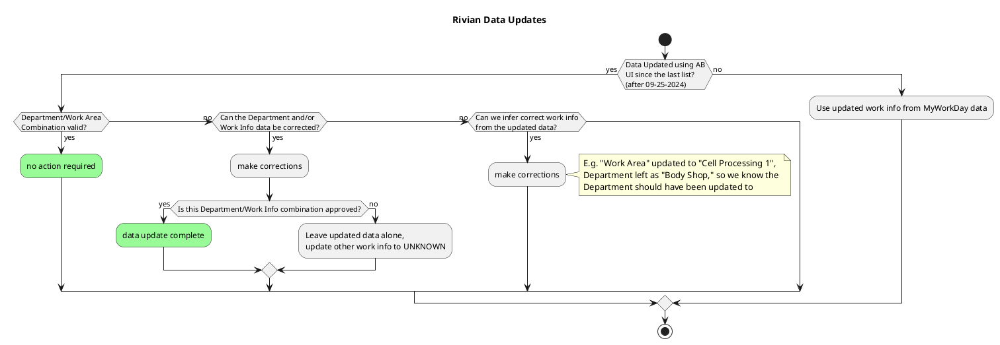

# Rivian

```plantuml
@startuml
title Rivian Data Updates
start
if (Data Updated using AB\nUI since the last list?\n(after 09-25-2024)) then (yes)
    if (Department/Work Area\nCombination valid?) then (yes)
    note right
        Valid meaning the combination has been approved
    end note
        #palegreen:no action required;
    (no) elseif (Can the Department and/or\nWork Info data be corrected?) then (yes)
        :make corrections;
        if (Is this Department/Work Info combination approved?) then (yes)
            #palegreen:data update complete;
        else (no)
            :Leave updated data alone,\nupdate other work info to UNKNOWN;
        endif
    (no) elseif (Can we infer correct work info\nfrom the updated data?) then (yes)
        :make corrections;
        note right
            E.g. "Work Area" updated to "Cell Processing 1",
            Department left as "Body Shop," so we know the 
            Department should have been updated to 
        end note
    endif
else (no) 
    :Use updated work info from MyWorkDay data;
endif
stop
@enduml
```
